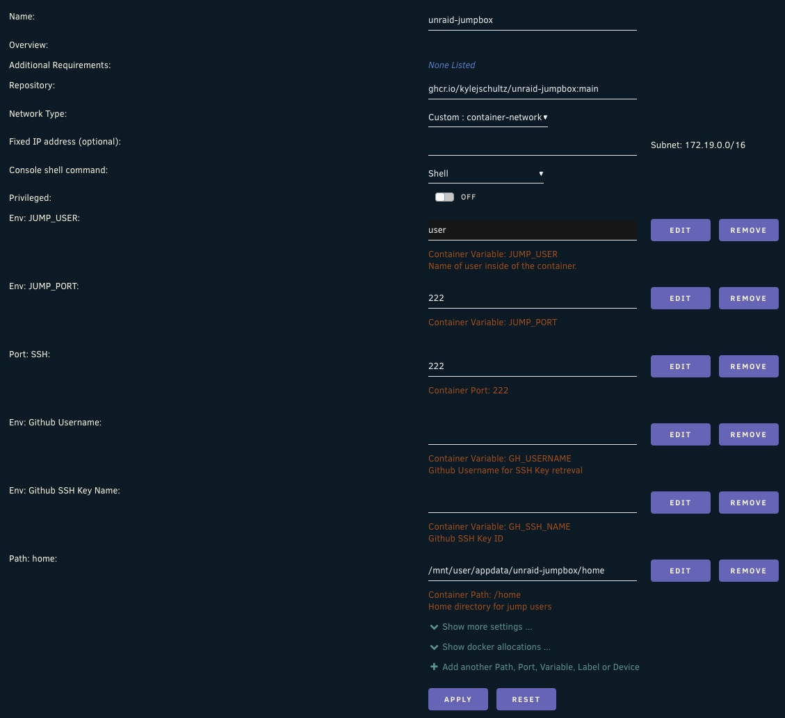

# Unraid Jumpbox

## Overview
A lightweight Ubuntu container used for SSHing onto an Unraid server to access only the paths mapped to the container. To be used in lieu of standard SSH or the web Console.

## Features
- Lightweight Ubuntu base image
- Zsh with Oh My Zsh and Powerlevel10k theme
- ColorLS installed for better file browsing experience (Alias of `lc` included in default `.zshrc`)
- SSH access with GitHub SSH key integration

## Future Enhancements
- Create Unraid app for easier deployment

## Environment Variables
- `JUMP_USER`: The username for the jump user.
- `JUMP_PORT`: The port on which the SSH daemon will listen (default: 22).
- `GH_USERNAME`: The GitHub username to fetch the SSH key from.
- `GH_SSH_NAME`: The id of the SSH key to fetch from GitHub (instructions below)

## Usage

### Github SSH Storage
#### Generating and Uploading an SSH Key to GitHub

1. **Generate an SSH Key**:
   ```sh
   ssh-keygen -t rsa -b 4096 -C "your_email@example.com"
   ```
   - Follow the prompts to save the key to the default location (~/.ssh/id_rsa) and set a passphrase if desired.

2. **Add the SSH Key to the SSH Agent**:
    ```sh
    eval "$(ssh-agent -s)"
    ssh-add ~/.ssh/id_rsa
    ```
3. **Upload the SSH Key to GitHub**:
    - Copy the SSH key to your clipboard:
        ```sh
        cat ~/.ssh/id_rsa.pub
        ```
    - Go to GitHub and navigate to **Settings** > **SSH and GPG keys** > **New SSH key**.
    - Paste the copied key into the *"Key"* field and give it a descriptive title.
    - Click Add SSH key.
4. **Get the SSH Key ID from GitHub**:
    - Use the GitHub API to list your SSH keys and find the key ID:
        ```sh
        curl -s -u your_github_username https://api.github.com/user/keys
        ```
    - Look for the `id` field corresponding to your uploaded key. You'll use this when deploying the container as the `GH_SSH_NAME` environment variable.
### Unraid Deployment
On the **Docker** tab, select **Add Container** and create the fields as listed in the screenshot below.

*Future plans are to create an Unraid app to make Unraid deployment smoother.*
### Docker Deployment
To deploy the container using Docker, you can use the following command:

```sh
docker run -d \
  --name unraid-jumpbox \
  -e JUMP_USER=your_jump_user \
  -e GH_USERNAME=your_github_username \
  -e GH_SSH_NAME=your_ssh_key_id \
  -e JUMP_PORT=22 \
  -p 22:22 \
  ghcr.io/kylejschultz/unraid-jumpbox:main
  ```

### Docker Compose Deployment
To deploy the container using Docker Compose, create a docker-compose.yml file with the following content:
```yaml
version: '3.8'
services:
  jumpbox:
    image: ghcr.io/kylejschultz/unraid-jumpbox:main
    environment:
      - JUMP_USER=your_jump_user
      - JUMP_PUBLIC_KEY=your_public_key
      - GH_USERNAME=your_github_username
      - GH_SSH_NAME=your_ssh_key_id
      - JUMP_PORT=22
    ports:
      - "22:22"
```

Then, run the following command to start the container:
```sh
docker-compose up -d
```

## Accessing the Container
Once the container is running, you can SSH into it using the following command:
```sh
ssh -p 22 your_jump_user@your_server_ip
```
Replace `your_jump_user`, `your_server_ip`, and `22` with the appropriate values.

## Advanced Usage
### Drive Mapping
It is recommended to mount a folder for your home directory. Map the location to `/home` inside of your container during runtime:
```sh
    docker run -d \
        --name unraid-jumpbox \
        -e JUMP_USER=your_jump_user \
        -e GH_USERNAME=your_github_username \
        -e GH_SSH_NAME=your_ssh_key_name \
        -e JUMP_PORT=22 \
        -v '/mnt/user/appdata/unraid-jumpbox/home':'/home':'rw,shared'
        -p 22:22 \
        ghcr.io/kylejschultz/unraid-jumpbox:main
  ```

Additionally, you can add any additional mount points you'd like access to in this same format. This will allow you to navigate through whatever folders you have shared with this container. This way, this container can be used in lieu of the web console browser or direct SSH to the unraid server, while still securing your connection with SSH and respecting the read/write configuration of the Unraid shares.